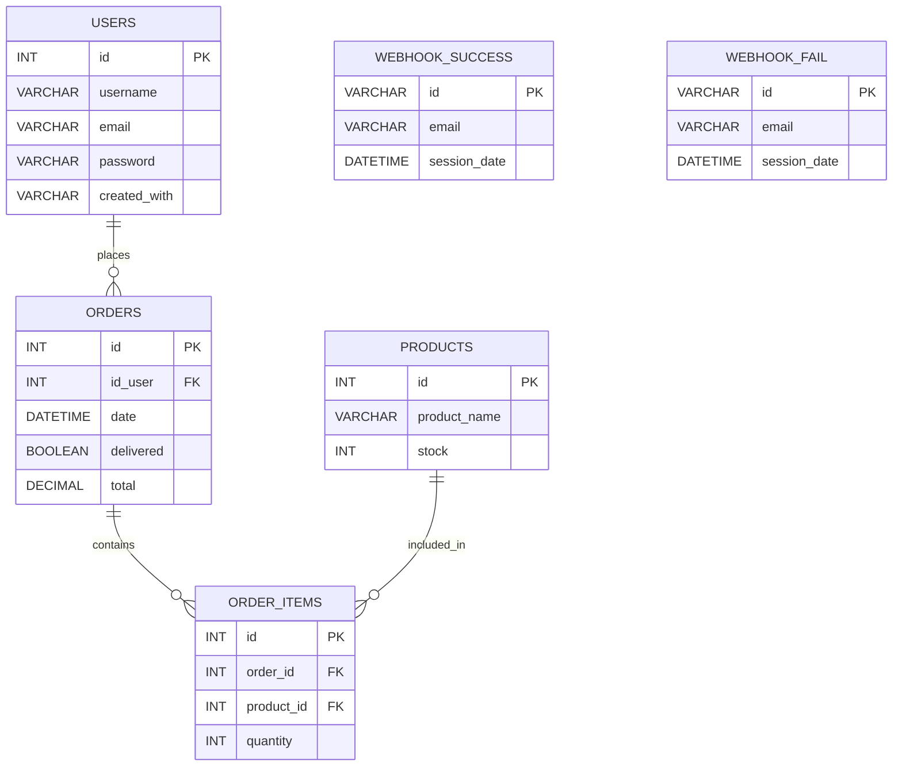

# Coffee website with Flask

This project is a web application developed using Flask, designed to practice Python and web development skills.

<video width="640" height="360" autoplay loop muted>
  <source src="video.mp4" type="video/mp4">
  Browser-ul tău nu suportă elementul video.
</video>

## 🧩 Technologies Used

This project was created to deepen my programming knowledge and gain practical experience with full-stack web development. The technologies and approaches used in this project are summarized below:

### **Backend**
- **Flask**: Chosen as the backend framework to build a complete web application.
- **Flask Blueprints**: Provides modular and scalable architecture, making the application easier to maintain and extend.

### **Frontend**
- **HTML & CSS**: Used to create a simple, clean, and user-friendly interface.

### **Database**
- **MySQL**: Stores essential user information such as `id`, `username`, `email`, and securely hashed passwords.

### **Authentication**
- **User dashboard**: Allows users to view orders, change passwords, and update usernames.
- **Password reset via email**: Implemented using **JWT tokens** to securely encode user information and validate access.
- **Google OAuth 2.0**: Allows users to log in quickly and securely with their Google account.

### **Payments**
- **Stripe**: Handles secure payment processing.
- **Webhook handling**:  
  - `payment_succeeded`: Clears the cart and sends a confirmation email.
  - `payment_failed` : Sends an email to alert the user about the situation.


## 📝Description of the structure

Below you can see the project’s structure, and I’ll go over each part step by step.


```
project_root/
│
├── .vscode/
│
├── app/
│   ├── __pycache__/
│   ├── static/
│   ├── templates/
│   ├── __init__.py
│   ├── auth.py
│   ├── buy_products.py
│   ├── change_password_with_email.py
│   ├── google_auth.py
│   ├── routes.py
│   ├── stripe.py
│   └── utils.py
│
├── venv/
│
├── .env
├── README.md
├── requirements.txt
└── run.py
```

### **Key Components**

- **app/**: Contains the Flask application.  
  - `__init__.py`: Creates the app and registers blueprints.  
  - `routes.py`: Main blueprint for general pages.  
  - `auth.py`: Handles registration, login, logout, and email confirmation.  
  - `buy_products.py`: Manages the shopping cart.  
  - `change_password_with_email.py`: Implements password reset via JWT email links.  
  - `google_auth.py`: Handles Google OAuth 2.0 login.  
  - `stripe.py`: Stripe payments and webhook events.  
  - `utils.py`: Helper functions used throughout the project.  
  - `templates/`: HTML templates.  
  - `static/`: CSS, images, and other static assets.  

- **venv/**: Virtual environment.  
- **.env**: Stores sensitive configuration (API keys, passwords, secrets).  
- **run.py**: Launches the Flask development server.  

## 🗄️Database structure:



### 🔗 Relationships
- **USERS → ORDERS**: one user can place multiple orders
- **ORDERS → ORDER_ITEMS**: one order contains multiple items
- **PRODUCTS → ORDER_ITEMS**: one product can appear in multiple orders
- **ORDERS ↔ PRODUCTS**: many-to-many relationship via `ORDER_ITEMS`
- **WEBHOOK_SUCCESS / WEBHOOK_FAIL**: standalone webhook log tables(help us keep track of the ones already processed)

## ⚙️How to run it on your machine:

Before doing the steps below you have to install all the necessary things for MySQL to work. You also have to do some modifications so that you can connect to the SMTP server.

For this watch the following videos:

[MySQL setup for Windows](https://www.youtube.com/watch?v=50CQoMs4vRo&list=LL&index=6&t=557s "A youtube video for this")

[MySQL setup for Mac](https://www.youtube.com/watch?v=wpGnJHb2R58 "A youtube video for this")

[How to get a mail app password generated](https://www.youtube.com/watch?v=MkLX85XU5rU "A youtube video for this")


### 1️⃣ Clone the repository

For this you should use these commands in the terminal:

```
git clone https://github.com/your-username/your-project.git
cd your-project
```

### 2️⃣ Create and activate a virtual environment

```
# On Windows
python -m venv venv
venv\Scripts\activate

# On macOS / Linux
python3 -m venv venv
source venv/bin/activate
```

### 3️⃣ Install the dependencies

``` 
pip install -r requirements.txt 
```

### 4️⃣ Set up environment variables

Create a file named .env in the root folder and add your configuration, for example:

```
APP_SECRET_KEY=your_secret_key
EMAIL=your_email
MAIL_PASSWORD=your_email_app_password
DB_PASS=your_database_password
OAUTHLIB_INSECURE_TRANSPORT=1
CLIENT_ID=your_google_client_id
CLIENT_SECRET=your_google_client_secret
SECRET=your_jwt_secret
PUBLISHABLE_KEY_STRIPE=your_stripe_publishable_key
SECRET_KEY_STRIPE=your_stripe_secret_key
ENDPOINT_SECRET_SUCCESS=your_stripe_success_webhook_secret
ENDPOINT_SECRET_FAIL=your_stripe_fail_webhook_secret

```

### 5️⃣ Run the application

```
python run.py
```

Then open your browser and go to:

```
http://127.0.0.1:5000
```

## 🧠 Conclusion
This project helped me strengthen my full-stack development skills by working with Flask, MySQL, and a clean HTML/CSS frontend. I implemented key real-world features such as user authentication, password reset via JWT, Google OAuth 2.0 login, and Stripe payments with webhook handling.

Building this application taught me how to design a secure, scalable, and modular web system, and it gave me the confidence to tackle more complex projects in the future. 